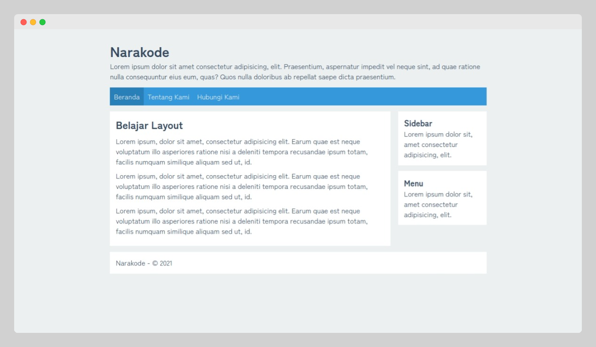
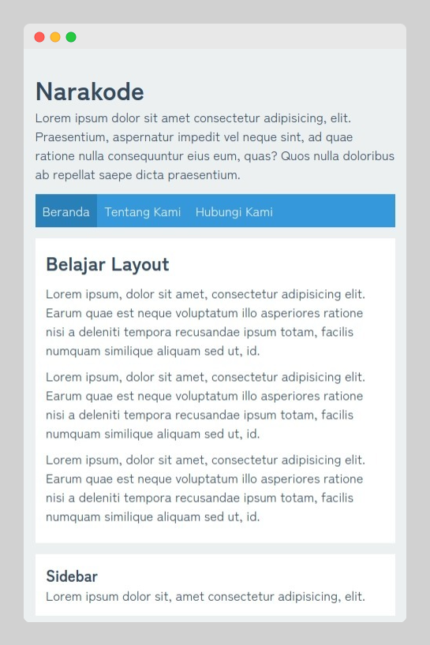

# layout-responsive

Layout responsive dengan HTML dan CSS.

Link Tutorial : [Membuat Layout Responsive dengan HTML dan CSS](https://www.narakode.com/membuat-layout-responsive-html-css)

## Screenshot

Desktop

Mobile

